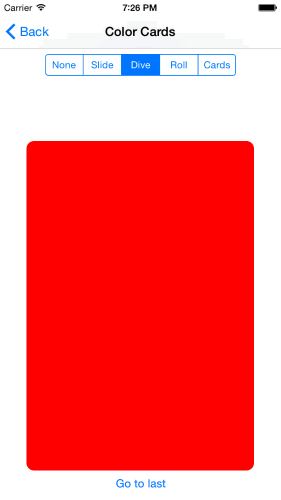
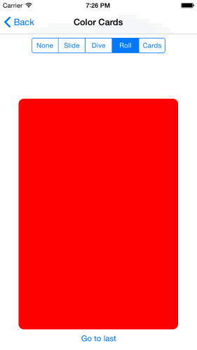
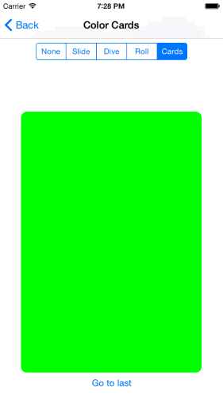
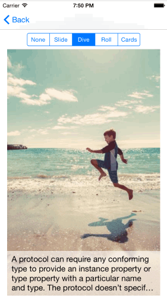
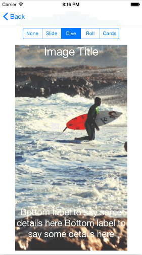

# MAGPagedScrollView

Now MAGPagedScrollView supports **Swift 3**. If you want to use Swift 1.2 - 2, [MadAppGang/MAGPagedScrollView!](https://github.com/MadAppGang/MAGPagedScrollView.)
MAGPagedScrollView is collection of some scroll classes that orginise views and view controllers as horizontall scroll flow

- 100% Swift (are you still developing with Objective-C ?)
- reuse behavior as UITabelView (memory efficient)
- easy to use (2 minutes to implement basic app)
- support and bug fixing (we are using this component in our products)

Please send us link to your apps, and we will create app gallery.

Here is video demo:

[](http://www.youtube.com/watch?v=HgSKxQVIOq0)

and real life example of onboarding screens:

[](http://www.youtube.com/watch?v=q18RqlyTpak)

[](http://www.youtube.com/watch?v=GzpCboLTPqc)

### Installation

add this line to Podfile:
```
    pod 'MAGPagedScrollView'
```

## PagedScrollView
Subclass of UIScrollVeiw, that will orginise it's subviews as scrolled cards.
And it's base class for other guys as well: **PagedReusableScrollView** and **PagedParallaxScrollView**.

the result looks like that:


to do it, just use this function:

```swift
    func addSubviews(aSubviews: [ViewProvider])
```

and add couple lines of code, here is example of code that demonstrate, how to do it:

```swift

    override func viewDidAppear(animated: Bool) {
        super.viewDidAppear(animated)

        scrollView.addSubviews([
            createView(0),
            createView(1),
            createView(2),
            createView(3)
        ])
    }
    

    func createView(color: Int) -> UIView {
        var view = UIView(frame: CGRectMake(0, 0, 100, 100))
        view.backgroundColor = UIColor.randomColor
        view.layer.cornerRadius = 10.0
        return view
    }

```

So the **PagedScrollView** operate with **ViewProvider** :

```swift
@objc protocol ViewProvider {
    var view: UIView! { get }
}
```

so **ViewProvider** is the class that can provide view. **UIViewController** is already could be used, providing it's own view.
**UIView** itself is also a **ViewProvider**, providing itself.

> Keep in mind, **PagedScrollView** don't keep reference to ViewProviders, so you have to handle ownership of this objects by yourself. But the views, that were provided by ViewProviders will be added as subview, so they will be reverenced by **PagedScrollView**

## Transition

You can use 5 build in transform classes for views sliding

### None


```swift
scrollView.transition = .None
```

### Slide


```swift
scrollView.transition = .Slide
```

### Dive



```swift
scrollView.transition = .Dive
```

### Roll



```swift
scrollView.transition = .Roll
```

### Cards



```swift
scrollView.transition = .Cards
```


## PagedReusableScrollView
That class works a UITabelViewController, it reuse **ViewProvider**. So you have to implement **PagedReusableScrollViewDataSource** protocol. This class owns  the ViewProvider objects and provide two functions for reuse:

```swift
    func dequeueReusableView(#tag:Int) -> ViewProvider?
    func dequeueReusableView(#viewClass:AnyClass) -> ViewProvider? 
```

so **ViewProvider** could be reused by tag or class

**PagedReusableScrollViewDataSource** require that functions:

```swift
    func scrollView(scrollView: PagedReusableScrollView, viewIndex index: Int) -> ViewProvider
    func numberOfViews(forScrollView scrollView: PagedReusableScrollView) -> Int
```

so putting all together, the example implementation could be like that:

```swift
extension ViewController3: PagedReusableScrollViewDataSource {
    
    func scrollView(scrollView: PagedReusableScrollView, viewIndex index: Int) -> ViewProvider {
        var newView:SimpleCardViewController? = scrollView.dequeueReusableView(tag:  1 ) as? SimpleCardViewController
        if newView == nil {
            newView =  SimpleCardViewController()
        }
        newView?.imageName = "photo\(index%5).jpg"
        return newView!
    }
    
    func numberOfViews(forScrollView scrollView: PagedReusableScrollView) -> Int {
        return 10
    }
    
}
```

the result will be like that:



## PagedParallaxScrollView
This view is populate to it's views about current parallax progress, from **-100** to **100**, **0** is central position.
So you can adjust constraint, positions, colors etc regarding position.

So view of **ViewProvider** should confirm protocol:

```swift
@objc protocol PagedScrollViewParallaxView: class {
    func parallaxProgressChanged(progress:Int)
}
```

If you want use ViewController as ViewProvider, you can make that view as **ParallaxViewProxy** subclass. So  **ParallaxViewProxy** redirect all parallax progress to it's parallaxController.

so ViewControllers's implementation could be like that:

```swift
extension ParralaxCardViewController: PagedScrollViewParallaxView {
    
    func parallaxProgressChanged(progress:Int) {
        self.imageView.bounds = CGRectMake(CGFloat(progress), 0, imageView.bounds.size.width, imageView.bounds.size.height)
        detailsCentralConstraint.constant = CGFloat(-progress*4)
        imageCentralConstraint.constant = CGFloat(-progress)
        titleTopConstraint.constant = CGFloat(abs(progress))
    }

}
```

and result of that:



## Using ViewController as ViewProvider
So anyone could be ViewProvider, but if you are using **UIViewController** subclass as **ViewProvider** you are expecting to have all View Controller lifecycle works as expected and described in apple doc:


[lifecycle](https://developer.apple.com/library/ios/documentation/UIKit/Reference/UIViewController_Class/index.html)

And expecting to get rotation callback for your child view controllers, for example handling it in iOS8+ :
```swift
func viewWillTransitionToSize(_ size: CGSize, withTransitionCoordinator coordinator: UIViewControllerTransitionCoordinator)
```
To implement it, regarding [Aplle Doc](https://developer.apple.com/library/ios/featuredarticles/ViewControllerPGforiPhoneOS/CreatingCustomContainerViewControllers/CreatingCustomContainerViewControllers.html), we have to implement some logic in our container view controller (example from Apple Doc):

```Objective-C
- (void) displayContentController: (UIViewController*) content;
{
   [self addChildViewController:content];                 // 1
   content.view.frame = [self frameForContentController]; // 2
   [self.view addSubview:self.currentClientView];
   [content didMoveToParentViewController:self];          // 3
}
```
The issue is that PagesScrollView is not a view controller and could not be container. Moreover, the view don't have reference to it's view controller, so you have to do it by yourself.
Fortunately, all you need is just inherit the ViewController, that owns PagedScrollView from **PagedScrollViewContainerViewController** :
```swift
class ViewController4: PagedScrollViewContainerViewController {
...
```
And it will implement optional functions to handle it. So all your child ViewControllers will behave as expected, getting all lifecysle messages like **viewWillAppear** and **viewWillDisappear** and rotation messages.
You can check it in source code in **ParralaxCardViewController**:
```swift
    override func viewWillTransitionToSize(size: CGSize, withTransitionCoordinator coordinator: UIViewControllerTransitionCoordinator) {
        println("\(self) viewWillTransitionToSize: \(size)  with coordinator: \(coordinator)")
    }
```

## Custom Transition

You can assign *customTransition* property to any transofrmation. The transformation is described by **PagedScrollViewTransitionProperties** struct:

```swift
struct PagedScrollViewTransitionProperties {
    var angleRatio:     CGFloat = 0.0
    var translation:    CGVector = CGVector(dx:0.0, dy:0.0)
    var rotation:       Rotation3D = Rotation3D()
}

struct Rotation3D {
    var x:CGFloat = 0.0
    var y:CGFloat = 0.0
    var z:CGFloat = 0.0
}
```

All build in transitions are **PagedScrollViewTransitionProperties** as well. So to create and apply custom property use that code:

```swift
scrollView.customGTransition = PagedScrollViewTransitionProperties(angleRatio: 0.5, translation: CGVector(dx:0.25,dy:0.0), rotation: Rotation3D(x:-1.0,y:0.0,z:0.0))
scrollView.transition = .Custom
```

# Credits

I'd appreciate it to mention the use of this code somewhere if you use it in an app. On a website, in an about page, in the app itself, whatever. Or let me know by email or through github. It's nice to know where one's code is used.

Implemented by MadAppGang.com, we do awesome iOS apps.

# License

**MAGPagedScrollView** published under the MIT license:

Copyright (C) 2015, Ievgen Rudenko, MadAppGang

Permission is hereby granted, free of charge, to any person obtaining a copy of this software and associated documentation files (the "Software"), to deal in the Software without restriction, including without limitation the rights to use, copy, modify, merge, publish, distribute, sublicense, and/or sell copies of the Software, and to permit persons to whom the Software is furnished to do so, subject to the following conditions:

The above copyright notice and this permission notice shall be included in all copies or substantial portions of the Software.

THE SOFTWARE IS PROVIDED "AS IS", WITHOUT WARRANTY OF ANY KIND, EXPRESS OR IMPLIED, INCLUDING BUT NOT LIMITED TO THE WARRANTIES OF MERCHANTABILITY, FITNESS FOR A PARTICULAR PURPOSE AND NONINFRINGEMENT. IN NO EVENT SHALL THE AUTHORS OR COPYRIGHT HOLDERS BE LIABLE FOR ANY CLAIM, DAMAGES OR OTHER LIABILITY, WHETHER IN AN ACTION OF CONTRACT, TORT OR OTHERWISE, ARISING FROM, OUT OF OR IN CONNECTION WITH THE SOFTWARE OR THE USE OR OTHER DEALINGS IN THE SOFTWARE.
